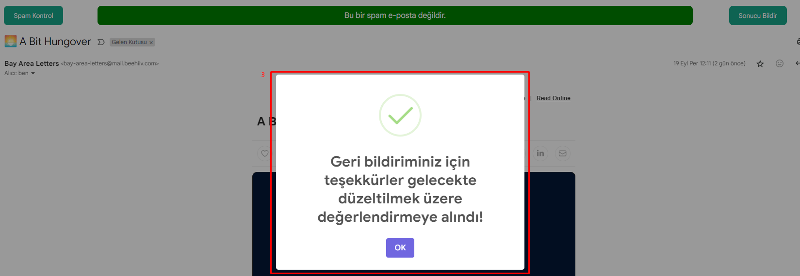

# Spam Detection Extension

A machine learning-based spam detection Chrome extension developed for Gmail. Checks your emails in real-time to determine if they are spam.

## Features

- **Real-time spam detection**: Automatically performs spam checks when you open emails
- **Machine learning-based**: Uses GloVe word embeddings and pre-trained models
- **Gmail integration**: Seamlessly integrates with Gmail interface
- **User feedback**: Allows you to provide feedback on prediction results
- **Visual interface**: Modern and user-friendly popup interface

## Screenshots

### Spam Email Example

### Normal Email Example  

### Feedback Examples

